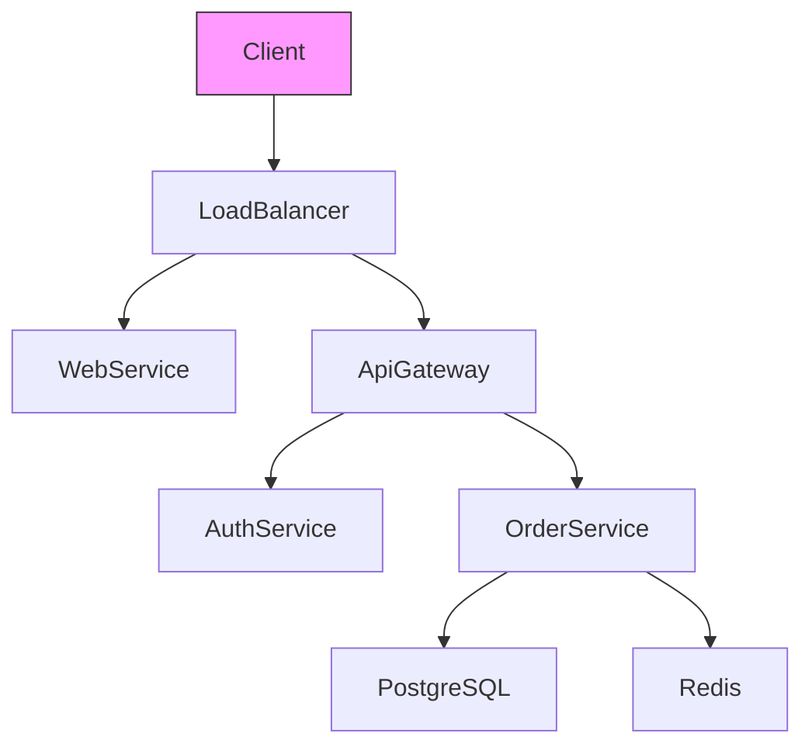

# architect-docs-builder

## Description

Generates architecture diagrams from code. Updates runbooks from recent incidents. Maintains decision records (ADRs).

---

## Purpose

Keep architecture documentation in sync with code. Auto-generate diagrams from Terraform, Kubernetes, and application code. Generate runbooks from incident patterns.

---

## Capabilities

- 📐 **Diagram generation**: From Terraform state, Kubernetes manifests
- 📝 **ADR generation**: Create architecture decision records
- 📚 **Runbook generation**: From incident post-mortems
- 🔗 **Dependency graphs**: Service maps, call graphs
- 📊 **Capacity docs**: Auto-draft resource sizing guides
- 🔄 **Sync detection**: Find undocumented code changes

---

## Commands

### Generate Diagram

```bash
architect-docs-builder diagram --input ./infra/terraform.tfvars --output architecture.md
```

### Generate Service Map

```bash
architect-docs-builder service-map --from-k8s ./k8s/ --output service-map.svg
```

### Generate ADR

```bash
architect-docs-builder adr --decision "Choose PostgreSQL vs MongoDB" --context "User store needs" --outcomes "PostgreSQL chosen for ACID compliance"
```

### Update Runbooks

```bash
architect-docs-builder runbooks --from-incident ./incidents/20260415-postgres-failover.md --output ./runbooks/
```

### Detect Documentation Drift

```bash
architect-docs-builder drift --code ./infra/ --docs ./docs/ --output drift-report.md
```

### Generate Capacity Doc

```bash
architect-docs-builder capacity --from-usage ./metrics/ --output capacity-guide.md
```

---

## Exit Codes

- `0` - Documentation generated ✅
- `1` - Generation failed ✖️
- `2` - Warnings only ⚠️
- `3` - Input parsing error ❌

---

## Output Format

```markdown
# Architecture Diagram (architecture.md)

## Overview

[Mermaid diagram of the service architecture]



## Components

### API Gateway
- **Location**: AWS API Gateway
- **Function**: Routing, auth, rate limiting
- **Depends On**: AWS Lambda, KMS

### Order Service
- **Location**: EKS Cluster (us-east-1)
- **Function**: Order processing, inventory
- **Depends On**: PostgreSQL, Redis, S3

### Database
- **Type**: Amazon Aurora PostgreSQL
- **Size**: 200GB, 3 replicas
- **Backup**: Continuous, RPO < 5min

## Changes

- Added AuthService for centralized authentication (2026-04-XX)
- Migrated from DynamoDB to PostgreSQL (2026-03-XX)
```

---

## Example Usage

```bash
# Generate architecture documentation
architect-docs-builder diagram --input ./infra/terraform.tfvars --output architecture.md

# Generate service map
architect-docs-builder service-map --from-k8s ./k8s/ --output service-map.svg

# Create ADR for new decision
architect-docs-builder adr --decision "Use Terraform over CloudFormation" --file ADR-2026-042.md
```

---

## Configuration

```yaml
# .architect-docs-builder.yaml
diagrams:
  format: mermaid|plantuml|c4
  auto_generate: true
  templates:
    - overview.md
    - detailed.md
    - sequence-diagram.md
adr:
  directory: ./docs/architecture-decisions/
  format: markdown
  number_format: "ADR-YYYY-NNN"
runbooks:
  template: ./runbooks/templates/
  auto_update: true
  categories:
    - incident-response
    - onboarding
    - disaster-recovery
capacity:
  data_source: ./metrics/
  output: capacity-guide.md
drift_detection:
  enabled: true
  schedule: "0 2 * * *"
  threshold: medium
```

---

## Notes

- Integrates with PlantUML, Mermaid, C4
- Works with GitHub, GitLab markdown
- Supports custom diagram styles
- Auto-syncs with code changes
- Version controls documentation separately
