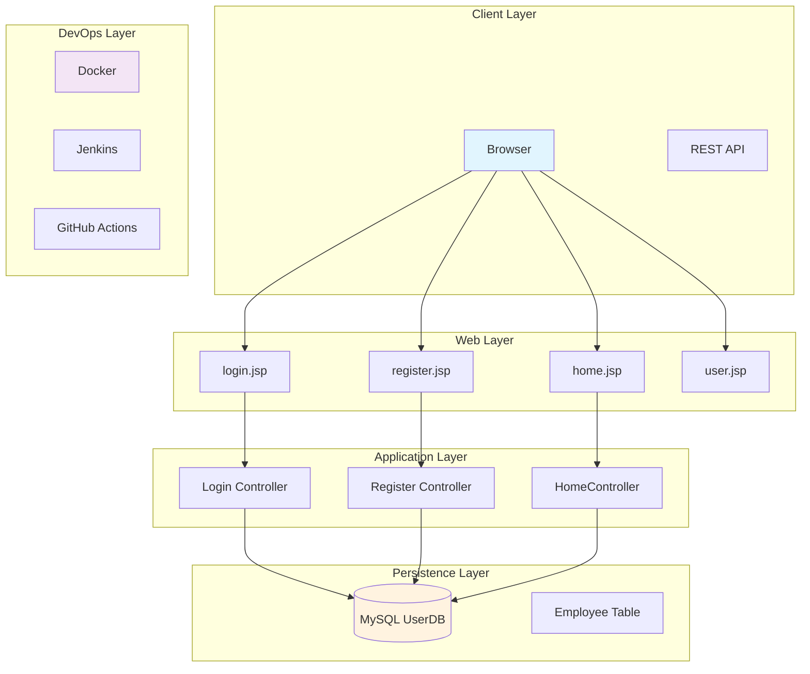
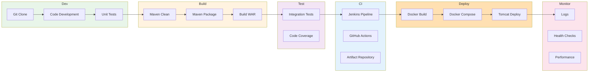

# Project-01: Java Login Application


---

## 📦 Project Overview

A **Spring Boot** login and registration web application that demonstrates DevOps practices including CI/CD, containerization, and deployment.

  

---

## 🏗️ Architecture Diagram



---

## 📁 Project Structure

```
Java-Login-App/
├── pom.xml                          # Maven build configuration
├── HELP.md                          # Spring Boot generated help
├── mvnw*                            # Maven wrapper scripts
│
├── src/main/java/com/dpt/demo/
│   ├── HomeController.java          # Home page controller
│   ├── login.java                   # Login functionality
│   ├── register.java                # Registration functionality
│   ├── MyWebAppApplication.java     # Spring Boot entry point
│   └── ServletInitializer.java      # WAR deployment init
│
├── src/main/resources/
│   └── application.properties       # Spring Boot configuration
│
└── src/main/webapp/pages/
    ├── confirm.jsp                  # Confirmation page
    ├── fail.jsp                     # Error page
    ├── home.jsp                     # Home page
    ├── login.jsp                    # Login page
    ├── register.jsp                 # Registration page
    └── user.jsp                     # User profile page
```

---

## 🗄️ Database Schema

```mermaid
erDiagram
    Employee {
        int unsigned id PK "Auto-increment"
        varchar first_name "250"
        varchar last_name "250"
        varchar email "250"
        varchar username "250"
        varchar password "250"
        timestamp regdate
    }
```

### SQL Commands

```sql
-- Create Database
CREATE DATABASE UserDB;

-- Create Table
CREATE TABLE Employee (
  id int unsigned auto_increment not null,
  first_name varchar(250),
  last_name varchar(250),
  email varchar(250),
  username varchar(250),
  password varchar(250),
  regdate timestamp,
  primary key (id)
);

-- View All Records
SELECT * FROM Employee;
```

---

## 🔧 DevOps Workflow



---

## 📡 API Endpoints

| Endpoint | Method | Description |
|----------|--------|-------------|
| `/` | GET | Home page |
| `/login` | GET/POST | Login form / Submit credentials |
| `/register` | GET/POST | Registration form / Create account |
| `/home` | GET | Home dashboard |

---

## 🐳 Dockerization

Create `Dockerfile`:

```dockerfile
FROM maven:3.6-openjdk-8 AS builder
WORKDIR /app
COPY pom.xml .
COPY src ./src
RUN mvn clean package

FROM tomcat:9.0.50-jdk8
COPY --from=builder /app/target/*.war /app/webapps/ROOT.war
```

Create `docker-compose.yml`:

```yaml
version: '3.8'

services:
  app:
    build:
      context: .
      dockerfile: Dockerfile
    ports:
      - "8080:8080"
    environment:
      - SPRING_DATASOURCE_URL=jdbc:mysql://mysql:3306/UserDB
      - SPRING_DATASOURCE_USERNAME=root
      - SPRING_DATASOURCE_PASSWORD=password
    depends_on:
      - mysql

  mysql:
    image: mysql:8.0
    environment:
      - MYSQL_ROOT_PASSWORD=password
      - MYSQL_DATABASE=UserDB
    ports:
      - "3306:3306"
    volumes:
      - mysql-data:/var/lib/mysql

volumes:
  mysql-data:
```

---

## 🚀 CI/CD Pipeline Example

### Jenkinsfile

```groovy
pipeline {
    agent any

    stages {
        stage('Checkout') {
            steps {
                checkout scm
            }
        }

        stage('Build') {
            steps {
                sh './mvnw clean package'
            }
        }

        stage('Test') {
            steps {
                sh './mvnw test'
            }
        }

        stage('Docker Build') {
            steps {
                sh 'docker build -t dpt-web-app .'
            }
        }

        stage('Deploy') {
            steps {
                sh 'docker-compose up -d'
            }
        }
    }
}
```

---

## 📝 Getting Started

### Prerequisites
- Java 8 (JDK 1.8)
- Maven 3.6+
- MySQL Server

### Build Commands

```bash
# Using Maven Wrapper
./mvnw clean package
./mvnw spring-boot:run

# Or with standard Maven
mvn clean package
mvn spring-boot:run
```

### Run Tests
```bash
./mvnw test
./mvnw test -Dtest=MyWebAppApplicationTests
```

### Build WAR
```bash
./mvnw clean install
```

---

## 🔐 Security Notes

⚠️ **Important**: The current implementation stores passwords in plain text. In production:
- Use password hashing (BCrypt)
- Implement CSRF protection
- Add input validation
- Use HTTPS

---

## 📚 Related Projects

- [DevOps Project-02](../DevOps%20Project-02/)
- [Java-Login-App Source](./Java-Login-App/)

---

## 📄 License

© 2026 DevCloud Ninjas Tech Community

---

## 🔄 CI/CD Pipeline

### Jenkins Pipeline

See [`jenkins/Jenkinsfile`](./Java-Login-App/jenkins/Jenkinsfile) for the complete pipeline including:
- ✅ Build stage with Maven
- ✅ Test stage with unit tests
- ✅ Security scanning
- ✅ Docker image building
- ✅ Multi-stage deployment (staging → production)

### GitHub Actions Alternative

Create `.github/workflows/ci.yml`:

```yaml
name: CI/CD Pipeline

on:
  push:
    branches: [master]
  pull_request:
    branches: [master]

jobs:
  build:
    runs-on: ubuntu-latest
    steps:
      - uses: actions/checkout@v3
      - name: Set up JDK 1.8
        uses: actions/setup-java@v3
        with:
          java-version: '1.8'
          distribution: 'temurin'
      - name: Build with Maven
        run: mvn -B package --file pom.xml
      - name: Test
        run: mvn test
      - name: Build Docker image
        run: docker build -t dptweb:${{ github.sha }} .
      - name: Push to Registry
        run: docker push dptweb:${{ github.sha }}
```

---

**Files Created in this Session:**
- `Project-01.md` - Comprehensive project documentation with diagrams
- `Dockerfile` - Two-stage Docker build
- `docker-compose.yml` - Docker Compose with MySQL
- `jenkins/Jenkinsfile` - Jenkins CI/CD pipeline

**Built with ❤️ for DevOps Learning**
